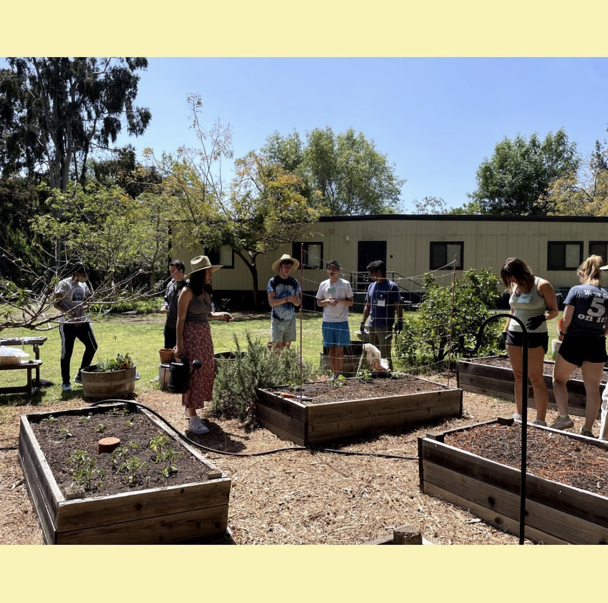

<h2> <strong>  Hello I'm Roger Wilson! I am a second year UCLA student exploring the converging worlds of statistics, mathematics, and computer science. This site will house my hobbies, projects and more. Welcome! </strong> </h2>

 
 
 
<h3> <strong> Projects </strong> </h3>
<ul>
  <li> UCLA ASA Datafest </li>
    <ul style="list-style-type:circle;">
      <li> Winner of 2022 competition, Don Ylvisaker Award for Best Insight </li>
      <li> Our team (the Data Dudes) was given 40 hours to analyze a complex dataset. We made it through 2 rounds of presentations and surpassed 70 other teams. </li>
      <li> This experience has strenghened my statistical skills and my coding abilities with large data frames. I will publish our findings soon! </li>
       
  </ul>
   
  <li> Bruin Actuarial Society Case Competitions </li>
    <ul style="list-style-type:circle;">
      <li> Our team of four was given one week to manage the liability and insurance policies for a fictitious insurance company. </li>
      <li> We then presented our findings from various models to a panel of officers. So far, I have competed in two case competitions. </li>
  </ul>
</ul>

<h3> <strong> Hobbies </strong> </h3>
<ul>
  <li> Juggling </li>
   <ul style="list-style-type:circle;">
      <li> I am the president of the UCLA Juggling Club for the 2022 - 2023 school year! </li>
      <li> I have been juggling for around three years now, and can successfully juggle 5 balls and 4 clubs :)    <a href="#footnote-1">[1]</a> </li>
   </ul>
   <li> Gardening </li>
   <ul style="list-style-type:;">
      <li> At home, I maintain a vegetable garden. I especially love growing zucchini, tomatoes, and carrots </li>
      <li> I am treasurer of UCLA DIG for the 2022-2023 academic year! </li>
      <li><a href =  "http://digucla.weebly.com/"> DIG UCLA homepage </a> </li>
      <li>   </li>
   </ul>
  <li> Swimming </li>
    <ul style="list-style-type:circle;">
      <li> I was a varsity swimmer and team captain in high school. </li>
      <li> I still love swimming for exercise in college and my favorite stroke is breaststroke.    </li>
  </ul>
</ul>
   

[1] From the <a href="https://libraryofjuggling.com/">Library of Juggling Homepage </a> 

